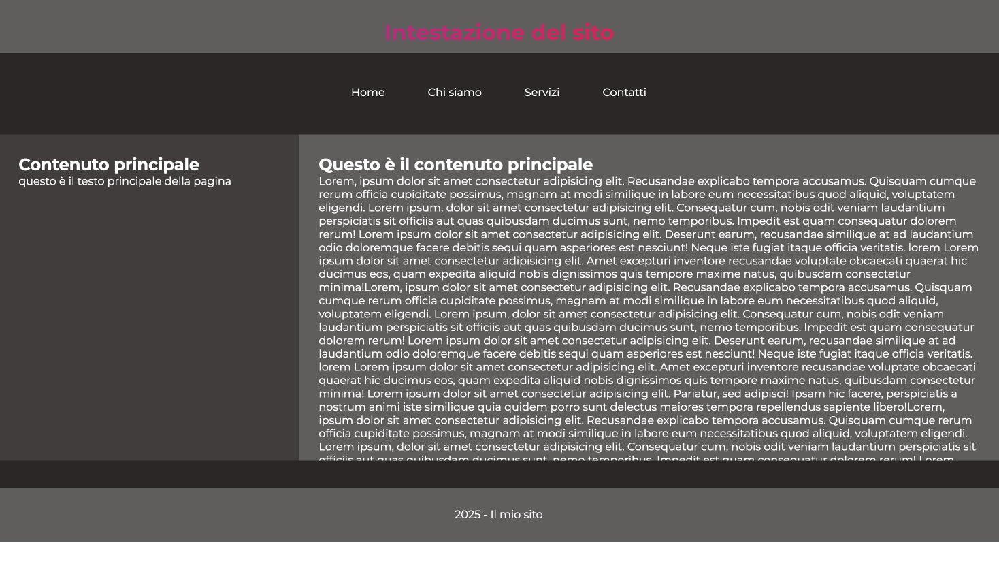
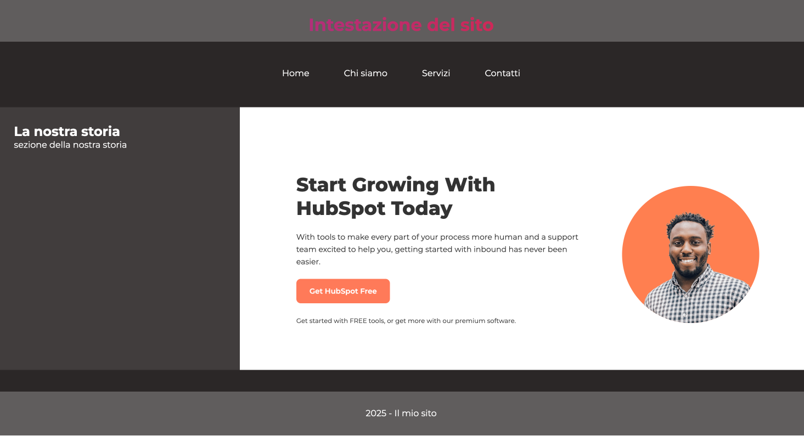
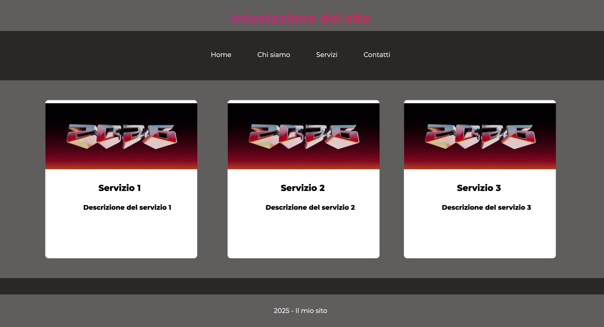
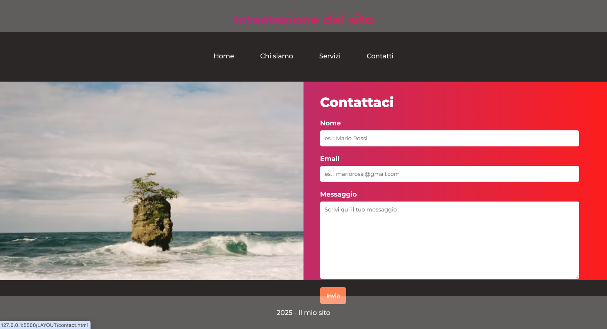

# LAYOUT SITO WEB
Sito sviluppato con la classe FullstackDev

*Ottobre 2025* 👩🏻‍💻
---






---

⚒️

| Nome | Linguaggio | Versione |
|------|------------|----------|
| HTML |Markup      | 5        |
| CSS  |Style       | 4        |

👩🏻‍💻

```
Avviare Golive da VSCode

